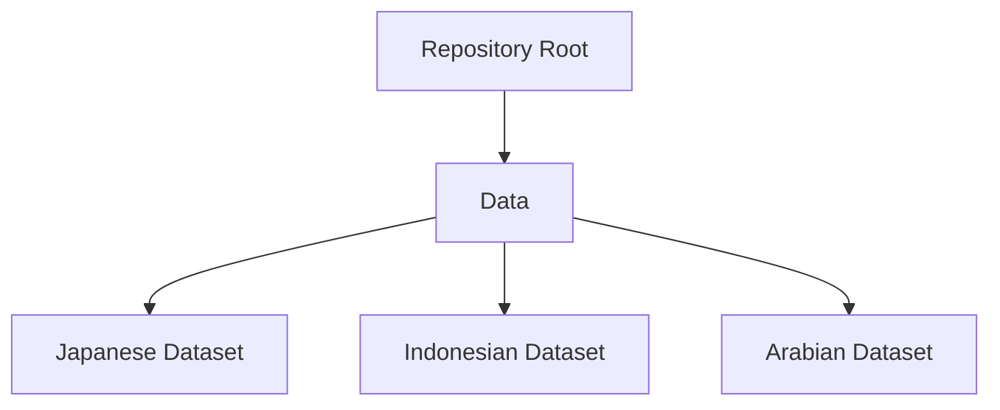

# Global Fictional Names Dataset

Copyright-free multi-nationality naming dataset.
---

## 📈 Repository Structure

## License
Distributed under the MIT License. This is an open-source contribution to the developer community by Fadhil Akbar Cariearsa.
